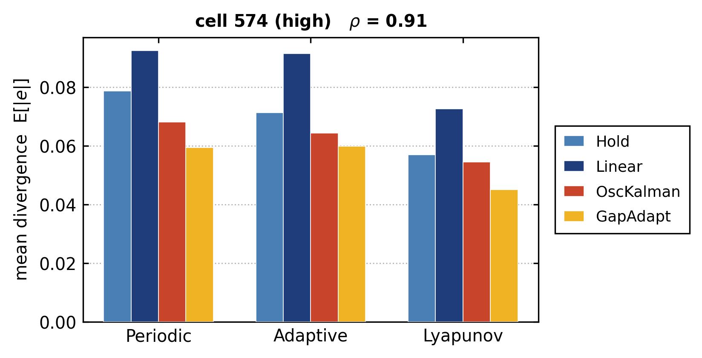

# Event-Triggered Synchronisation for Cellular Digital Twins

**When is it worth running a model on the digital twin, and when is it better to
just hold the last value?**

A DT of a radio cell is only useful if it reflects the cell it
mirrors. Keeping it perfectly current would mean transmitting the measured state
every slot exactly the bandwidth the network would rather spend on users. So
the twin is synchronised only occasionally, and in between it is on its own.

Two decisions need to be made:

|  | Decision | Called here |
|---|---|---|
| **When** to spend a transmission | the triggering rule | the **policy** |
| **What** the twin shows in between | the state estimate | the **estimator** |

---

## System model

Time is slotted, one slot every 10 minutes.

- **Physical twin** — the true traffic e.g load of a cell, `x_k`.
- **Digital twin** — a mirror `x̂_k` held remotely.
- **Synchronisation** — each slot the policy emits `s_k ∈ {0,1}`. If `s_k = 1`
  the true sample is transmitted and the estimator is corrected with it;
  otherwise nothing is sent and the twin displays the estimator's prediction.
- **Divergence** — `e_k = |x_k − x̂_k|`, evaluated at *every* slot, including
  those with no transmission. This is what a synchronisation scheme has
  to control.
- **Overhead** — `s̄ = (1/K) Σ_k s_k`, the fraction of slots transmitted.

### Problem

Given a communication budget `r_q`,

```
minimise    ē = (1/K) Σ_k e_k
subject to  s̄ ≤ r_q
```

The budget is a hard constraint, not a preference: in a deployment it is imposed
by the network operator, not chosen by the twin.

---

## The two design axes

**Policies — when to synchronise**


**Estimators — what to display in between**


---

## A sample result



Mean divergence on a highly structured cell, at a 10% communication budget. Under every trigger the cycle-aware estimators are the most accurate, while extrapolating a slope is the worst choice throughout.
---


Evaluation uses one week of the
[Telecom Italia Milan](https://doi.org/10.7910/DVN/EGZHFV) open dataset.

Requirements are in [`requirements.txt`](requirements.txt).

## License

Figures, data and documentation under
[CC BY 4.0](https://creativecommons.org/licenses/by/4.0/).
